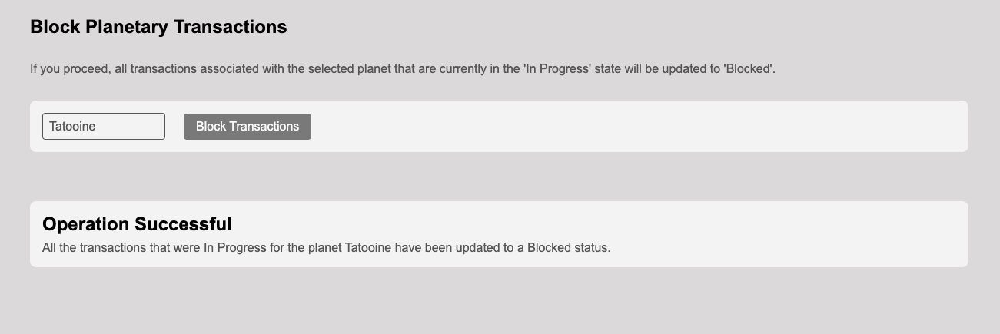

## Installation

To install dependencies, navigate to the root of the project and run in a terminal:

```bash
npm install
```

## Getting Started

To start the project using the local development server, run:

```bash
npm install
```

The application should now be accessible through [http://localhost:3000](http://localhost:3000) in the browser.

## Functional Walkthrough

### Layout

The application is primarily divided into two parts:

* **Sidebar:** contains two interactive options (`Transactions` and `Security Panel`), and the main content accessed through routing using `React Router`.

* **Main Content:** accessed thorugh routing using `React Router`.

### Transactions


When the active route is [/transactions](http://localhost:3000/transactions), the main content renders the Transactions screen, which is divided into two sections:

* **Filters:** here, there is a date input that allows filtering transactions by a start date, along with a button to initiate the search. The search button will only be enabled if these two conditions are met:

  * There is a date entered in the input.
  * The entered date is not the same as the one previously searched for immediately before.

* **DataGrid:** a table that displays aggregated information, taking into account the requirements 1, 2, and 3 specified in the challenge prompt.

### Security Panel


When the active route is [/security](http://localhost:3000/security), the main content renders the Security Panel screen. This screen consists of:

* **Dropdown:** loads all available planets and allows selecting one of them.

* **Block Transactions Button:** will send an updated list of transactions for that planet to the API, updating the status of all of them from `inProgress` to `Blocked`. The button will only be enabled if these two conditions are met:

  * There is a planet selected in the dropdown.
  * There are transactions in the `inProgress` state for the selected planet.

If the operation is executed successfully, a text indicating this will be rendered.



Another important aspect is that updating the state of transactions triggers the invalidation of the cache in react-query for certain queries. Therefore, the transactions screen will reflect these changes immediately.

